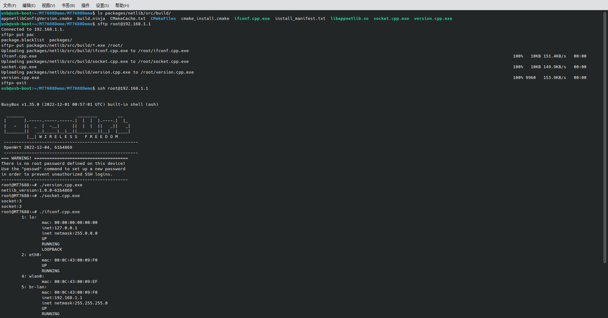
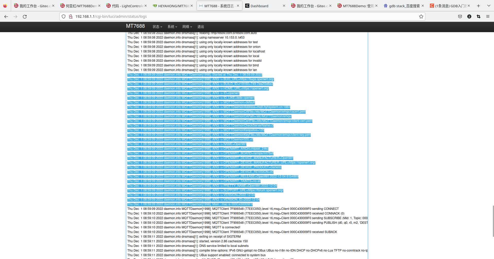
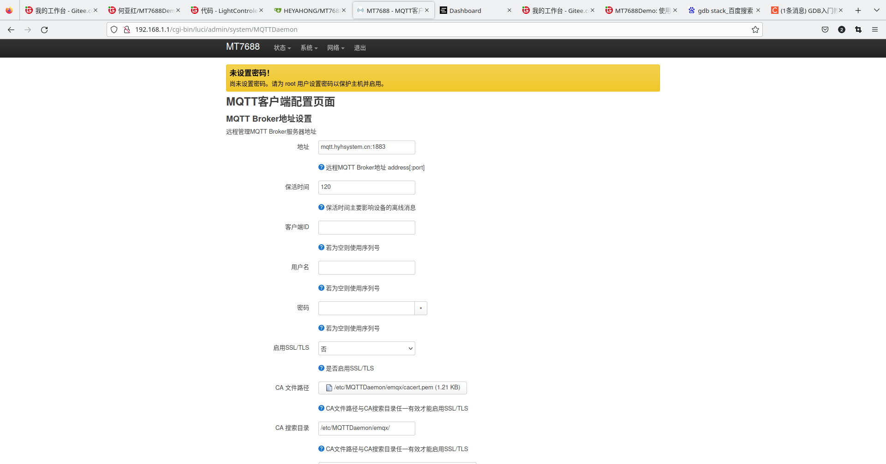
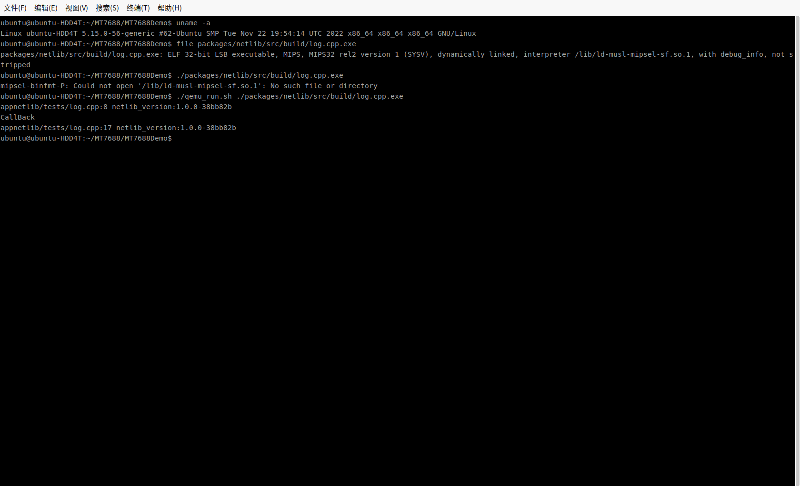

# 说明

这是一个使用openwrt开发MT7688的例子(仅供测试)。

硬件为HLK-7688A模块,采用MT7688AN作为主芯片，具有32M Flash与128M DDR2 RAM。

## 源代码下载

由于本源代码包含第三方源代码,故直接下载可能有部分源代码缺失，需要通过以下方法解决:

- 在进行git clone 使用--recurse-submodules参数。

- 若已通过git clone下载,则在源代码目录中执行以下命令下载子模块:

  ```bash
   git submodule update --init --recursive
  ```

## key-build

采用openwrt的工具usign生成,生成后可在应用中使用公钥校验文件。

在openwrt中使用以下命令生成密钥对：

```bash
usign -G -c "注释信息" -p key-build.pub -s key-build
```

## 软件包

软件包实现目录为 [packages/](packages/) 。除开第三方软件包，其余的软件包均将源代码放在本地目录，一般放在该软件包Makefile所在目录。对于C/C++程序，一般采用CMake作为构建工具，可生成适应各种IDE的工程。

### cli

软件包实现目录为 [packages/cli/](packages/cli/)。命令行程序。作为软件包模板。现无任何功能。

### netlib

软件包实现目录为 [packages/netlib/](packages/netlib/) 。网络库，包装一些常用的网络操作。作为库软件包模板。包含部分测试程序（编译完成后在 packages/netlib/src/build/,后缀为.exe），测试程序不会安装至openwrt。



### MQTTDaemon

软件包实现目录为 [packages/MQTT/MQTTDaemon/](packages/MQTT/MQTTDaemon/) 。MQTT守护进程，可连接MQTT Broker。



### luci-MQTTDaemon

软件包实现目录为 [packages/MQTT/luci-MQTTDaemon/](packages/MQTT/luci-MQTTDaemon/) 。MQTT守护进程的luci界面。




# 编译

openwrt编译过程中,需要下载大量的数据，尤其是要确保github.com等外网的联通，若因下载失败而编译失败，请手动下载相应的软件包放入openwrt/dl目录,再重新编译。若网络不好需要编译很多次极为正常。

若在中国境内，建议做以下设置：

```bash
#启用go模块代理
export GO111MODULE=on
export GOPROXY=https://goproxy.cn
```

## 编译环境

编译环境的设置见[https://openwrt.org/docs/guide-developer/start](https://openwrt.org/docs/guide-developer/start) 。通常在编译过程中缺什么就安装什么即可。

除了自行安装工具，在Linux下还可直接使用docker(需要自行安装docker)命令直接进入编译环境：

```bash
#若一开始使用docker那么需要一直使用docker。否则openwrt做的某些软链接会失效。

#此openwrt-be镜像推荐用于脚本测试，除非手动安装环境不成功，不推荐直接用于整个openwrt的编译，推荐使用ubuntu镜像。
sudo docker run -it --rm -u  `id -u`:`id -g` -v `pwd`:/work -w /work heyahong/openwrt-be:22.03 /bin/bash
#更多关于此docker镜像的说明见https://hub.docker.com/r/heyahong/openwrt-be

#此ubuntu镜像安装了编译所需工具，可直接作为编译环境。
sudo docker run -it --rm -u  `id -u`:`id -g` -v `pwd`:/work -w /work heyahong/buildenv-ubuntu22.04:base
#更多关于此docker镜像的说明见https://hub.docker.com/r/heyahong/buildenv-ubuntu22.04

```

## 常用操作

所有操作都需要在执行bootstrap.sh后进行。成功执行bootstrap.sh后可进行以下操作：

- 编译

  ```bash
  #直接编译
  make 
  #直接编译(显示详细信息)
  make V=sc
  ```

- 配置kconfig

  ```bash
  make menuconfig
  ```

- 清理

  ```bash
  #清理生成的文件
  make clean
  #清理所有（建议备份好openwrt/dl再清理）
  make distclean
  ```

# 烧录

编译完成后（未报错直接退出），所有生成的文件在openwrt/bin目录下,其中用的最多的是用于sysupgrade的bin文件。可采用以下方式安装：

- 通过openwrt的固件升级安装。注意：不要保留配置。
- 通过bootloader（如breed，模组厂家的uboot）安装固件。注意：布局需要选公版布局，非公版布局将导致mac地址不正确。

# 调试

## 串口

串口0为调试串口，主要用于调试信息输出，参数为57600 8N1。

串口主要有以下用途：

- uboot阶段输出启动信息。在此阶段也可进行一些其它操作，如升级固件（openwrt固件损坏救砖方式之一）等。
- linux启动过程中输出内核启动信息。
- linux启动完成后可通过串口进入控制台(按ENTER)，可打开SHELL。
- 用户程序启动后输出信息(如直接向/dev/ttyS0写入信息,`echo 信息 > /dev/ttyS0`)。

## 调试信息

openwrt作为一个完整的linux系统，可使用多种方式进行调试。

在本工程中通常采用syslog输出调试信息,可通过以下方式查看输出的syslog:

- 登陆luci界面后，在 状态 -> 系统日志 的WEB界面查看
- 登陆控制台后（通过串口登陆或者ssh登陆），使用 logread 命令读取系统日志。
- 如果在luci界面中设定了其它方式（如输出到文件或者外部服务器），可使用其它方式查看系统日志。

在用户程序中，可通过以下方式输出syslog：

- 在sh脚本中，可使用 logger 命令向系统日志写入信息。
- 在C/C++程序中，可使用 syslog 函数输出系统日志（需要先使用 openlog 打开系统日志）


## 软件包中用户二进制文件的测试

有时候需要对某个编译后得到的用户二进制程序进行测试，除了使用硬件测试（使用各种工具上传到开发板中），还可以使用qemu测试（使用QEMU用户程序模拟器）。

在ubuntu中，可使用以下命令安装QEMU（其他平台请自行查找资料安装）：

```bash
sudo apt-get install qemu-user
```

### 运行二进制文件

注意：所有的运行操作必须在编译完成后，若未编译完成，可能不可运行。

```bash
./qemu_run.sh 待运行的程序及参数
```


